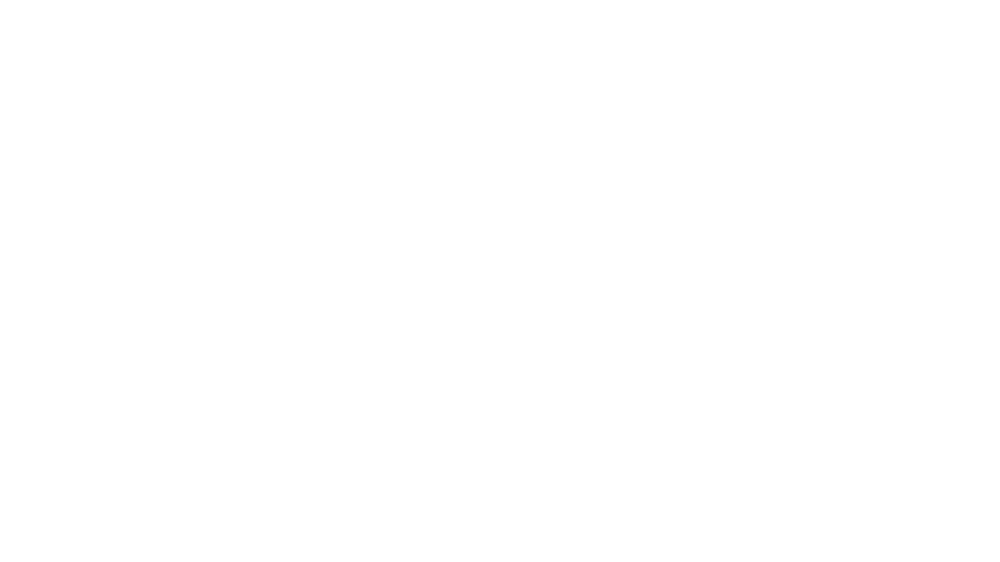

<p align="center">
  
</p>

<h1 align="center">AgenticOps – AI Network Configuration Agent </h1>

<p align="center">
  
  
  
  
  
  
  
  
</p>


## Features

- **Automatic topology discovery** — reads any GNS3 topology via REST API (localhost:3080)
- **Device classification** — identifies routers (Dynamips/IOU/QEMU), switches, VMs, Docker containers, VPCS, NAT nodes
- **Zero-touch SSH setup** — configures SSH from scratch via GNS3 Telnet console
- **IP assignment** — auto-assigns IPs on interfaces and sub-interfaces
- **Routing protocols** — OSPF, EIGRP, RIPv2, static routes
- **Access Control Lists** — create/remove ACLs blocking any traffic type (ICMP, TCP, UDP, specific ports)
- **VLAN management** — router-on-a-stick with dot1Q sub-interfaces
- **Docker container Configuration** — configures IP and gateway on alpine:latest container with docker_exec_command
- **Browser Classification** — recognise any Browser from GNS3 Market as endpoint_vm (ATM only Firefox)
- **Configuration backup** — saves running-config to local files
- **Troubleshooting** — checking the connectivity of the network
- **Documentation** — generate documentation in .md format of the whole network
- **Security Audit** — checks passwords, SSH version, CDP, VTY ACLs, SNMP, logging, exec-timeout and generate documentation in .md format
- **Containerized** - the agent is installed in a Docker Container, good for portability
- **Bilingual** — responds in Romanian or English based on user input
- **Portable** — works with any GNS3 topology, no hardcoded IPs or device names


## Structure

```
agenticOps/              
├── Dockerfile           
├── .dockerignore        
├── .gitignore
├── README.md
├── requirements.txt
├── agenticops/
│   ├── agent.py
│   ├── tools.py
│   ├── gns3_client.py
│   └── net_config.py
├── logs/
├── docs/
└── backups/     
```

## Install with Docker

Build the image:

```bash
docker build -t agenticops .
```

Run the container:

```bash
export OPENROUTER_API_KEY="sk-or-v1-your-key-here"
chmod +x run.sh 
./run.sh
```

## Run the Container manually:

```bash
docker run -it --rm --network host \
  --name agenticops \
  -e OPENROUTER_API_KEY="sk-or-v1-your-key-here" \
  agenticops
```

## After you configure SSH on R1
Add a route on your Ubuntu machine so you can reach the internal GNS3 network through R1:
```bash
sudo ip route add 10.0.0.0/8 via <R1_DHCP_IP>
```
Replace `<R1_DHCP_IP>` with the IP that R1 received via DHCP on the NAT interface (FastEthernet2/0). Check it with `show ip interface brief` on R1's console.

## In case of 503 error on the Main Model:
```bash
export OPENROUTER_MODEL="nvidia/nemotron-3-super-120b-a12b:free"
```
